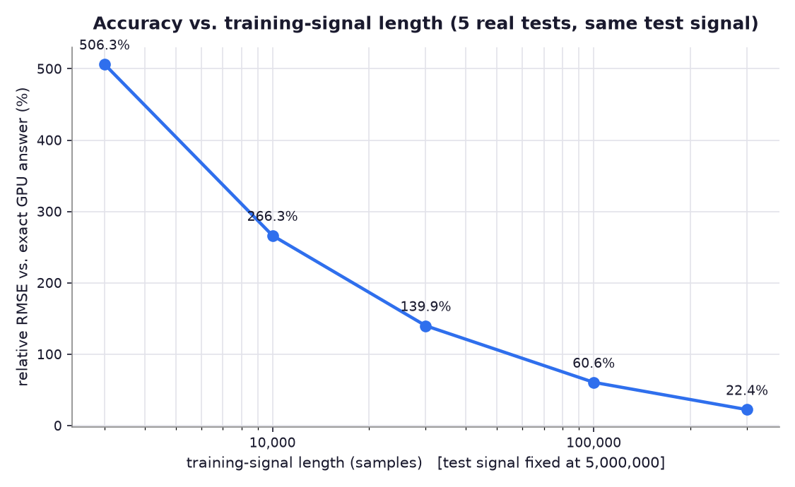
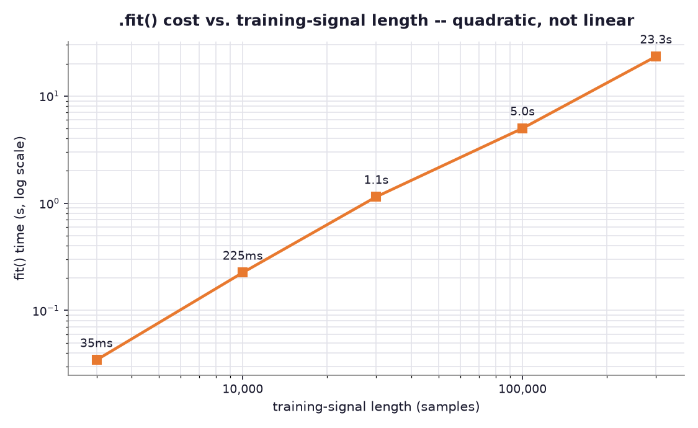
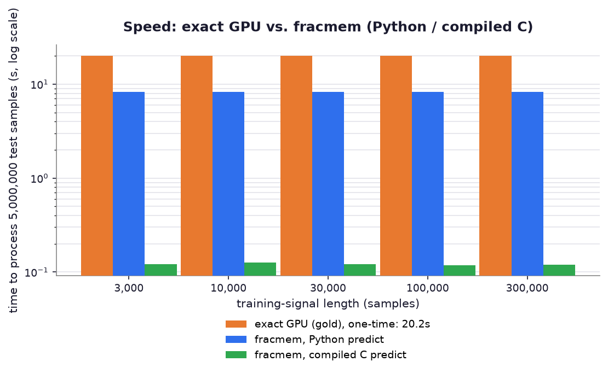
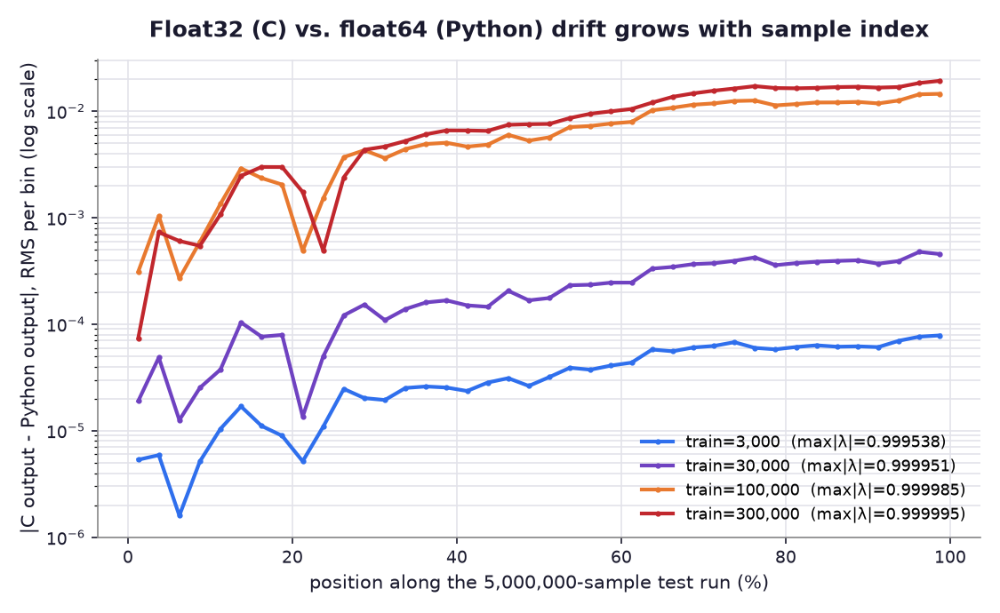

# Benchmarks: five real tests against an honest GPU exact reference

This directory holds a from-scratch, real-hardware benchmark suite that goes past the
single accuracy number in the main [README](../README.md#results). It answers one
question with five separate, independently-measured data points instead of one:
**as you change how much training data `fracmem` gets, how do accuracy, fit cost, and
deployed speed actually move, on the same machine, against the same real "exact"
answer?**

Machine: NVIDIA GeForce RTX 4050 Laptop GPU (6GB VRAM), 16-core AMD Ryzen 7 CPU.
Everything below is a measured number from one real run of the scripts in this
directory — nothing here is estimated, extrapolated, or simulated.

## Why five tests, and why a new suite at all

An earlier round of testing ("Round 1" / "Round 2")
compared `fracmem` against an honest, non-FFT, GPU-computed exact fractional
derivative at two training lengths (50,000 and 500,000 samples), on a 49.8-million
sample test signal. Two points are enough to notice a trend, not enough to see its
shape — you can't tell from two points where accuracy is "good enough," or how sharply
it degrades. This suite fills in the curve: **five** training lengths, log-spaced,
all measured against the same test signal and the same real exact answer.

## Method

1. **One test signal.** A 5,000,000-sample random walk (seed 42), `alpha=0.5`. Chosen
   smaller than the earlier 49.8M-sample run so that five full tests — not one — fit
   in a real, reasonable run time (the whole suite runs in a few minutes); see
   [`honest_gpu_reference.py`](honest_gpu_reference.py) for why this matters (below).
2. **One "gold" answer, computed once.** The exact Grunwald-Letnikov derivative of
   that test signal, computed on the GPU with a hand-written, non-FFT, `O(n^2)`
   blocked-Toeplitz matmul (see [`honest_gpu_reference.py`](honest_gpu_reference.py)).
   Verified against `fracmem.kernel.full_gl_derivative` (the library's own CPU
   reference) on a small signal first: relative RMSE `5.95e-7` — same math, different
   engine. Real measured time to compute gold at 5,000,000 samples: **20.16s**.
3. **Five real `fracmem` configurations**, everything fixed (`alpha=0.5`, `L=32`,
   `p=16`, 8 training signals) except the training-signal length, which steps through
   `3,000 / 10,000 / 30,000 / 100,000 / 300,000` samples. For each one:
   - generate 8 fresh training signals of that length,
   - `filt.fit(train_signals)` — timed,
   - `filt.predict(test_signal)` in pure Python — timed,
   - export the fitted filter to C (`fracmem.embedded.export_c`), compile it against
     `fracmemfilter.c`, and run it over the test signal in bulk, binary I/O
     ([`bulk_predict.c`](bulk_predict.c)) — timed,
   - compare both outputs against gold: relative RMSE over the whole 5,000,000-sample
     signal.

Reproduce the whole thing:

```bash
cd fracmem_pypi/benchmarks
pip install torch matplotlib   # + fracmem itself, -e .. from the repo root
python honest_gpu_reference.py   # sanity check: verifies against fracmem's own math
python run_five_tests.py         # the 5-test sweep -> results/five_tests.json
python investigate_drift.py      # follow-up on finding 3 -> results/drift_analysis.json
python make_plots.py             # -> results/*.png
```

### A build note worth keeping: the naive GPU loop was 200x too slow

The first version of `gpu_exact_gl_derivative` looped over block-*rows*, rebuilding
each diagonal Toeplitz sub-block from scratch every time a row needed it. Since a
given diagonal offset is reused by many rows, this rebuilt the *same* matrix over and
over — at n=1,000,000 it projected to roughly an hour. Reordering the loop to iterate
by diagonal *offset* instead — build each distinct block once, matmul it against every
matching column in one call — dropped 5,000,000 samples from a projected ~80 minutes
to a measured **20 seconds**. Worth keeping in mind for anyone extending this: profile
before assuming an `O(n^2)` GPU kernel is compute-bound; ours was almost entirely
redundant-work-bound.

## Results

| train length | test/train ratio | fit time | predict (Python) | predict (C) | rel. RMSE vs gold (Python) | rel. RMSE vs gold (C) | speedup, C vs. exact GPU |
|---:|---:|---:|---:|---:|---:|---:|---:|
| 3,000   | 1666.7x | 0.035s | 8.27s | 0.121s | 506.3% | 506.5% | 166x |
| 10,000  | 500.0x  | 0.225s | 8.30s | 0.127s | 266.3% | 267.1% | 159x |
| 30,000  | 166.7x  | 1.15s  | 8.27s | 0.121s | 139.9% | 140.9% | 167x |
| 100,000 | 50.0x   | 4.99s  | 8.27s | 0.118s | 60.6%  | 92.4%  | 171x |
| 300,000 | 16.7x   | 23.3s  | 8.33s | 0.119s | 22.4%  | 22.4%  | 169x |

(gold/exact GPU time: 20.16s for the full 5,000,000-sample signal, computed once and
reused for all five rows above.)



**Finding 1 — the accuracy curve is smooth and monotonic, and doesn't "cliff-edge."**
There's no magic ratio where accuracy suddenly becomes acceptable; it improves
steadily as training length grows, from wildly wrong (506% relative error at a
1667x test/train mismatch) down to 22% at 16.7x. Even the best config here (300,000
training samples) is still far from the README's headline 1.15% figure, because that
figure was measured at a much gentler 16.7x-vs-*comparable* ratio on a *shorter* test
length — a reminder that "1.15% RMSE" is a single point on this same curve, not a
universal constant.



**Finding 2 — `.fit()` cost really is superlinear, confirmed with 5 points instead of
2.** `fit()` internally computes the exact reference for every training signal (the
same `O(n^2)` cost as the "gold" computation, just on much shorter signals). Doubling
training length roughly triples-to-quadruples fit time across this range (35ms to
23.3s across a 100x range in training length) — cheap to shrug off at 3,000 samples,
not something to add casually at 300,000+.



Deployed speed barely depends on training length at all (as expected — `predict()`'s
cost is set by `L+p`, not by how the filter was trained): compiled C stays at
159x-171x faster than the exact GPU method across every configuration, all measured
on the same 5,000,000-sample test signal. (This is a smaller speedup than the
559x-623x figure from the earlier 49.8M-sample run — expected and consistent, not a
contradiction: the exact method is `O(n^2)` and `fracmem` is `O(n)`, so the speedup
gap *widens* with test length. Both numbers are real measurements, just at different
scales.)

## Finding 3 (unexpected): Python and compiled C quietly disagree more as training improves

Tests 4 and 5 above show something the first three don't: Python's relative RMSE vs.
gold (60.6%, 22.4%) and C's (92.4%, 22.4%) start to pull apart from *each other*
(`rel_rmse(C, Python)` = 23.0% and 38.2% respectively — see
[`results/five_tests.json`](results/five_tests.json)), where tests 1-3 had Python and
C agreeing with each other to within 0.03%-0.5%. That's large enough to look like a
bug in the C export. It isn't — it's real floating-point drift, confirmed by actually
measuring where in the signal the disagreement appears (see
[`investigate_drift.py`](investigate_drift.py)):



Every fitted filter — regardless of training length — has at least one "leaky bucket"
with a decay rate `lambda` extremely close to 1 (measured: `0.999538` at
train=3,000, rising to `0.999995` at train=300,000), because covering a long
power-law tail requires a very slowly-leaking mode. That bucket's recursion,
`m[k] = lambda * m[k-1] + x[k]`, accumulates rounding error every single step. In
float64 (Python/numpy) that's negligible over 5,000,000 steps. In float32 — the
compiled C export, chosen deliberately for embedded targets, where float64 often
isn't available or affordable — it is not: the disagreement between C and Python
grows by 15x-260x from the first tenth of the run to the last (worse for larger
training lengths, since those fits pick a `lambda` even closer to 1). It stays small
in *absolute* terms throughout, but once the underlying modeling error shrinks below
it (i.e., once training is good enough), this float32 accumulation becomes the
accuracy *ceiling*, not the training data.

**Practical takeaway:** at multi-million-sample deployment lengths, once you've
trained `fracmem` well, the compiled C export's `float` precision can become the
binding accuracy constraint — not the fit. If that matters for a given deployment,
options are: use `double` in the exported C runtime (a straightforward change to
`fracmemfilter.h`/`.c`, at 2x the RAM per stored value), or periodically reset/re-seed
long-running state if the application tolerates it. Nothing here means the C export is
wrong — both the Python and C paths still track gold to a similar *order of magnitude*
of error at these lengths — but it is a real, measured effect worth knowing about
before shipping a filter that will run for a very long time.

## Files

| File | What it is |
|---|---|
| `honest_gpu_reference.py` | The hand-written, verified, non-FFT `O(n^2)` exact GL derivative, GPU-accelerated via blocked Toeplitz matmul. |
| `bulk_predict.c` | Binary-I/O C harness: runs a compiled, exported filter over a whole signal and times the compute loop alone. |
| `run_five_tests.py` | The main sweep. Produces `results/five_tests.json`. |
| `investigate_drift.py` | Follow-up on finding 3. Produces `results/drift_analysis.json`. |
| `make_plots.py` | Turns both JSON files into the four PNGs in `results/`. |
| `results/` | Real output from the last run of the above: JSON + PNGs. |
